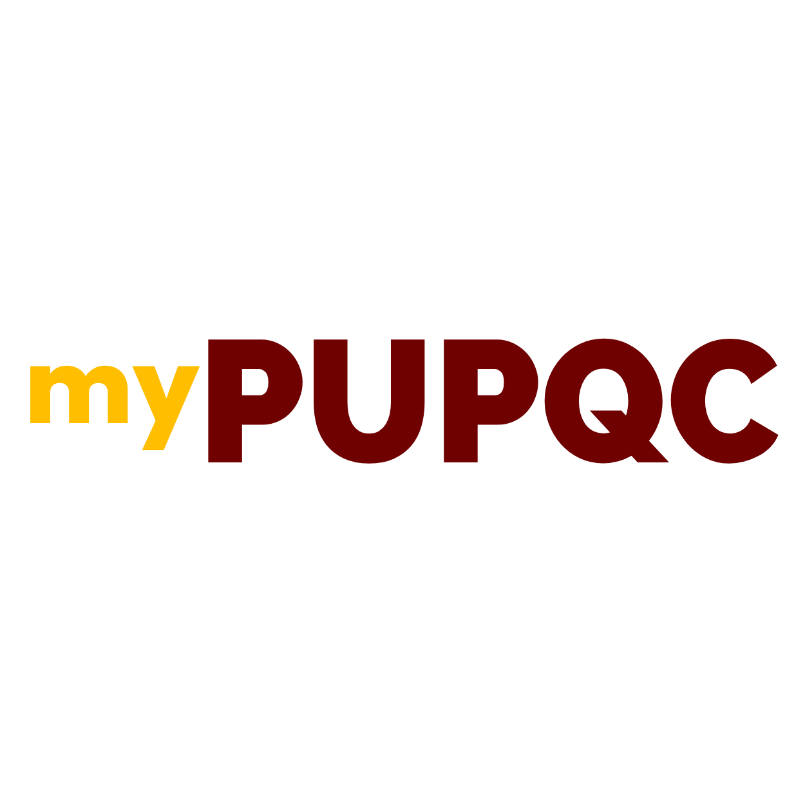

# myPUPQC (Web Application)

    

 

## Project Details

|                     |                                                                                                                                                                                                                                                                                                                                                               |
| ------------------- | ------------------------------------------------------------------------------------------------------------------------------------------------------------------------------------------------------------------------------------------------------------------------------------------------------------------------------------------------------------- |
| **Description**     | This project is for fullfillment of requirements in subject "Capstone Project 1".                                                                                                                                                                                                                                                                             |
| **Date Started**    | August 15, 2022                                                                                                                                                                                                                                                                                                                                               |
| **Current Version** | v1.0.0                                                                                                                                                                                                                                                                                                                                                        |
| **Developers**      | <ul><li>[Razal, Shane Jean](https://github.com/chibbiichan)</li><li>[Soria, Zsyrhill Anne](https://github.com/Aexlin)</li><li>[Villaruz, Micah](https://github.com/micahvllz)</li><li>[Tulod, James Paul](https://github.com/polekstulod)</li><li>[Arevalo, Miguel Carlos](https://github.com/MicoAye13)</li></ul> _Students of PUPQC, BSIT 3-1 (Batch 2019)_ |

 

## Technologies Used for this Application

- [CodeIgniter 3](https://www.codeigniter.com/userguide3/index.html)
- [jQuery](https://api.jquery.com/)
- [Velzon - 5 in 1 Premium Multipurpose Admin & Dashboard Template](https://themesbrand.com/velzon/)

 
